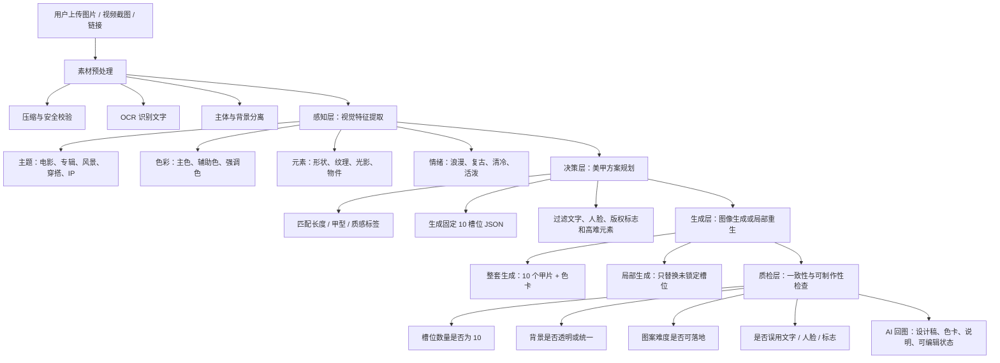

# Nail Muse AI 说明文档

## 1. 项目定位

**项目名称：** Nail Muse AI  
**一句话介绍：** 喜欢的万物，存在指尖。把一张图、一首歌、一部电影里的喜欢，变成一套独属于用户的美甲设计稿。

Nail Muse AI 面向喜欢美甲、但不擅长描述灵感的人群。用户可以上传专辑封面、电影海报、旅行照片、穿搭图片、视频截图或链接截图，系统将图像中的主题、色彩、情绪和元素拆解成美甲可落地的设计语言，再返回一套 10 个甲片的设计稿、色卡和设计说明。

当前 Demo 采用静态样例与交互模拟结合，重点展示“用户发图到 AI 回图”的产品闭环：上传灵感图、选择长度/甲型/质感标签、生成 10 个固定槽位的甲片、锁定喜欢的甲片、局部重生其他甲片、调整甲片顺序，并用色卡和设计说明辅助用户与美甲师沟通。

## 2. 用户需求分析

### 2.1 目标用户

- 想把喜欢的专辑、电影、IP、穿搭、风景转化为美甲的人。
- 需要和美甲师沟通方案，但不会用专业术语描述的人。
- 喜欢 DIY、抽卡、收藏方案，并愿意反复调整局部设计的人。
- 美甲师或工作室，可用它快速生成灵感板和客户沟通稿。

### 2.2 用户痛点

- “我知道我喜欢这张图，但说不出来它适合什么美甲。”
- “直接让模型生成整张图，十个甲片位置经常乱，风格也不稳定。”
- “有一两个甲片很好看，但重新生成会全部换掉。”
- “美甲不能照搬海报文字、人脸或复杂场景，需要变成可制作的图案。”

### 2.3 产品价值

Nail Muse AI 不只生成一张漂亮图，而是把任意灵感图转化为可沟通、可修改、可落地的美甲设计稿。它更像一个“美甲灵感翻译器”：把用户的视觉喜好翻译成色卡、甲型、质感、图案分配和单甲说明。

## 3. 可拆解的互动场景

### 场景 A：图片灵感 DIY

用户上传专辑封面、电影海报、旅行照片、宠物照片、穿搭图或截图。AI 提取主题、主色、辅助色、情绪关键词和可转译元素，返回 10 个甲片设计稿。

**示例：** 上传《La La Land》海报，提取夜空蓝、紫色渐变、聚光灯、黄色裙摆、音乐线条和城市剪影，生成“夜空、聚光灯和可落地材质”的美甲套装。

### 场景 B：风格描述自由设计

用户不上传图片，只输入“日常一点、不要太夸张、保留蓝色和橙色”这类自然语言。系统生成一套基础方案，并允许用户像抽卡一样反复换局部。

### 场景 C：图片 + 标签约束

用户上传图片后选择美甲专业标签：长度、甲型、质感、难度。AI 不再只靠图片自由发挥，而是按用户偏好生成更适合佩戴和制作的结果。

### 场景 D：锁定喜欢的单甲后局部重生

用户点选某个甲片上的对号，将其锁定。重新生成时系统只替换未锁定槽位，已锁定的甲片保持不变。这个场景解决了“喜欢其中一个，但不想整套重来”的核心问题。

### 场景 E：美甲师沟通稿

系统输出色卡、甲片位置、材质说明、图案难度和禁用元素，方便用户拿给美甲师沟通。美甲师可以快速判断是否需要简化图案、替换材质或调整手指分配。

## 4. 美甲专业维度设计

### 4.1 长度

- 短甲：适合日常、通勤、低维护，图案应集中在 1-2 个主视觉甲。
- 中长：适合展示渐变、法式边、跳色、星点和小图案。
- 长甲：适合更强视觉表达，但需要控制复杂度，避免每个指甲都高难度。

### 4.2 甲型

- 椭圆：温和、通用，适合大多数图案和日常佩戴。
- 杏仁：显手长，适合浪漫、复古、电影感、轻华丽风格。
- 方圆：边缘规整，适合几何、色块、法式、复古波普。
- 芭蕾：视觉更强，适合舞台感、猫眼、亮片、延长甲展示。

### 4.3 质感

- 亮面：适合高饱和色、果冻色、海报感和商业展示。
- 冰透：适合渐变、轻透、梦幻、星空、水光感。
- 磨砂：适合低调质感、复古、秋冬、雾面艺术感。
- 磁吸光：美甲语境中的 cat-eye/磁吸光，不是动物眼睛。适合用“线性光带、银河感、移动高光、金属微粒”来描述。

### 4.4 难度控制

为了兼顾专业性与落地性，每套方案建议控制为：2-3 个主视觉甲、3-4 个辅助图案甲、其余为纯色/渐变/法式/低难度点缀。系统会避免每个甲片都画复杂人物、文字或微缩场景。

## 5. “用户发图”到“AI 回图”的逻辑流程图



## 6. JSON 提取与一致性设计

### 6.1 为什么需要 JSON 中间层

只靠 Prompt 直接生成图片不够稳定。模型可能把 cat-eye 理解为真的猫眼，可能把标题文字画到甲片上，也可能一会儿生成 8 个甲片、一会儿生成 12 个甲片。Nail Muse AI 的核心思路是先让多模态模型输出结构化 JSON，再用 JSON 拼接生成 Prompt 和前端展示。

JSON 是感知、决策、生成之间的“合同”。前端按 JSON 固定槽位渲染；后端按 JSON 拼接生图 Prompt；质检模型按 JSON 检查结果是否合格。

### 6.2 关键 JSON 字段

```json
{
  "project": {
    "title": "La La Land Night Set",
    "theme": "夜空、聚光灯、音乐和城市剪影",
    "mood": ["浪漫", "电影感", "梦幻", "轻复古"],
    "avoid": ["文字", "演员脸", "电影标题", "版权标志", "复杂真实手部"]
  },
  "source_analysis": {
    "input_type": "movie poster",
    "dominant_colors": [
      {"name": "midnight navy", "hex": "#08114A", "usage": "base"},
      {"name": "violet purple", "hex": "#4B24B8", "usage": "gradient"},
      {"name": "spotlight yellow", "hex": "#FFD84D", "usage": "accent"},
      {"name": "warm cream", "hex": "#FFF2C6", "usage": "negative space"}
    ],
    "visual_motifs": ["星空点点", "聚光灯", "黄色裙摆弧线", "城市剪影", "音乐线条"],
    "text_policy": "extract mood only, do not render text on nails"
  },
  "user_constraints": {
    "length": "short",
    "shape": "oval",
    "finish": "glossy",
    "difficulty": "daily wearable"
  },
  "slots": [
    {
      "slot_id": "R1",
      "finger": "right_thumb",
      "role": "hero",
      "base_color": "#08114A",
      "pattern": "银河碎闪斜向带",
      "material": "glossy gel with fine shimmer",
      "locked": false,
      "seed": 11001
    },
    {
      "slot_id": "R2",
      "finger": "right_index",
      "role": "support",
      "base_color": "#4B24B8",
      "pattern": "冰透紫色渐变",
      "material": "jelly gradient",
      "locked": false,
      "seed": 11002
    }
  ],
  "layout": {
    "total_slots": 10,
    "order": ["R1", "R2", "R3", "R4", "R5", "L1", "L2", "L3", "L4", "L5"],
    "background": "transparent",
    "output_mode": "separate_nail_assets"
  }
}
```

### 6.3 JSON 如何保证界面一致性

- 固定 10 个槽位：R1-R5 为右手，L1-L5 为左手，不允许模型自由改变数量。
- 固定素材边界：每个槽位只接收一个透明背景甲片图，前端统一摆放到版式里。
- 固定色卡来源：色卡来自 JSON 中的 `dominant_colors`，不是从最终生成图里随机取色。
- 固定专业标签：长度、甲型、质感先进入 `user_constraints`，再参与 Prompt 拼接。
- 固定禁用规则：文字、人脸、商标、版权标志进入 `avoid` 和负面 Prompt。
- 固定可编辑状态：锁定、排序、局部重生都绑定 `slot_id`，而不是绑定图片坐标。

## 7. 返回稳定性方案

### 7.1 不建议只生成一张大图

一次性生成“10 个甲片 + 色卡”的整张大图适合快速预览，但不适合交互修改。缺点是：某个甲片满意时无法单独保留；重新生成会全部变化；裁切位置可能漂移；色卡和甲片背景容易不一致。

### 7.2 推荐方案：固定槽位 + 分资产生成

更稳定的实现方式是先生成 JSON，再按槽位生成 10 个透明背景甲片资产，最后由前端合成展示页。

推荐流程：

1. 多模态模型提取灵感 JSON。
2. 决策模型生成 10 个槽位的 nail spec。
3. 图像模型按槽位生成单独透明 PNG：R1、R2、R3、R4、R5、L1、L2、L3、L4、L5。
4. 前端根据固定版式合成 10 个甲片、色卡和说明。
5. 用户锁定喜欢的甲片后，只对未锁定槽位重新请求生成。

### 7.3 锁定与局部重生

用户点击某个甲片的对号后，该槽位进入 `locked: true`。再次生成时，后端只为 `locked: false` 的槽位拼接 Prompt 并发起生成，已锁定槽位沿用旧图片 URL。

```json
{
  "regenerate_request": {
    "project_id": "demo_lalaland_001",
    "keep_style_id": "style_lalaland_night_v1",
    "locked_slots": ["R1", "R2", "L3"],
    "regenerate_slots": ["R3", "R4", "R5", "L1", "L2", "L4", "L5"],
    "constraints": {
      "shape": "oval",
      "finish": "glossy",
      "difficulty": "daily wearable"
    }
  }
}
```

### 7.4 如何固定十个位置返回

图像生成接口不要只说“生成十个甲片”，而要把位置变成明确结构：

- 每个槽位单独有 `slot_id`。
- 每个槽位有独立 seed 或 reference id。
- 每个槽位有独立图案职责：主视觉、辅助、纯色、渐变、点缀。
- 生成结果返回数组，数组顺序必须和 `layout.order` 一致。
- 前端只负责渲染，不让模型决定排版。

这样即便模型生成图案有变化，十个位置也不会乱。

## 8. 用户素材处理与文字规避

### 8.1 用户可上传的素材

- 专辑封面：提取色彩、情绪、视觉符号，不直接复制文字。
- 电影海报：提取场景氛围、主色、光影、代表性非人脸元素。
- 穿搭图片：提取服装配色、面料质感、配饰形状。
- 风景照片：提取天空、水面、植物、城市光影等自然元素。
- IP 或链接截图：提取风格和配色，避免直接复制版权标志。
- 视频截图：取关键帧后按图片流程处理。

### 8.2 如果素材中有文字

美甲面积小，文字难以制作，也容易涉及版权标志。因此系统会先进行 OCR 识别，将文字列入 `avoid`。文字只参与“情绪理解”，不进入最终甲片图案。

处理策略：

- 标题文字：不画文字，只提取字体情绪，例如复古、舞台、科幻。
- 歌词或标语：不复制原句，只转为抽象符号，例如星点、音符线、光束。
- 品牌 Logo：不生成 Logo，只取色彩与材质感。
- 人物脸：不画具体脸，只保留姿态感、服装色或场景氛围。

## 9. 视觉特征提取方式

### 9.1 主题提取

多模态模型先判断素材类别，如专辑、电影、旅行、穿搭、IP、宠物或风景，再给出主题摘要。主题摘要必须能转译成美甲语言，例如“夜空和聚光灯”比“电影海报”更可用。

### 9.2 颜色提取

系统会提取 4-6 个颜色，并为每个颜色分配用途：

- base：底色，占比最高。
- accent：强调色，用于跳色或小图案。
- gradient：渐变色，用于冰透、猫眼或晕染。
- neutral：留白色，用于降低复杂度。

### 9.3 元素提取

元素会分为三类：

- 可直接转译：星点、花、线条、圆形、格纹、光束、波纹。
- 需要抽象转译：人物、城市、电影场景、文字、乐器。
- 不建议转译：复杂人脸、大段文字、版权 Logo、过细背景。

## 10. 接口落地方案

### 10.1 整体链路

前端接收用户素材和标签，上传到后端。后端调用多模态模型做感知，再调用语言模型生成结构化 JSON，最后调用图像生成模型输出甲片资产。

接口可分为四类：

- `/api/analyze`：分析用户上传素材，返回主题、色卡、元素和禁用项。
- `/api/plan`：结合美甲标签，生成 10 槽位 JSON。
- `/api/generate`：调用图像生成 API，返回透明背景甲片图或整套预览图。
- `/api/regenerate`：传入锁定槽位，只生成未锁定甲片。

### 10.2 类可灵图像 API 调用结构

```json
{
  "model": "image-generation-model",
  "input": {
    "prompt": "A single oval press-on nail tip, transparent background, glossy gel material, midnight navy base, diagonal galaxy shimmer band, daily wearable nail art, product mockup, no text, no face, no logo",
    "negative_prompt": "real cat eye, animal eye, text, letters, logo, human face, realistic hand, cluttered background, extra nails, deformed nail shape",
    "image_reference": "source_image_url",
    "style_reference": "style_board_url",
    "size": "1024x1024",
    "transparent_background": true,
    "seed": 11001
  },
  "metadata": {
    "project_id": "demo_lalaland_001",
    "slot_id": "R1",
    "shape": "oval",
    "finish": "glossy",
    "style_id": "style_lalaland_night_v1"
  }
}
```

### 10.3 Prompt 拼接逻辑

Prompt 不由用户一句话直接决定，而是由以下部分拼接：

1. 固定产品描述：单个甲片、透明背景、产品图、适合美甲制作。
2. 用户标签：长度、甲型、质感、难度。
3. 来源图分析：主题、主色、辅助色、可转译元素。
4. 单槽位任务：R1 是主视觉，R2 是渐变，L1 是音乐线条等。
5. 禁用规则：不要文字、不要人脸、不要真实手部、不要多余甲片。
6. 风格锚点：统一插画/半真实美甲材质、统一色卡和统一光影。

### 10.4 质量检查

生成后进入质检：

- 数量检查：是否只有一个甲片资产，或整套是否正好 10 个。
- 背景检查：是否为透明背景或统一底色。
- 语义检查：是否误把 cat-eye 画成猫眼。
- 安全检查：是否出现人脸、Logo、电影标题或大段文字。
- 专业检查：是否适合美甲制作，是否过于复杂。

不合格时可自动重试，并把失败原因写入下一次负面 Prompt。

## 11. Demo 原型说明

### 11.1 页面结构

Demo 采用横屏网页展示，视觉风格为插画感波普海报：奶油纸底、珊瑚红、深蓝、芥末黄、浅粉、手绘感黑边和硬阴影。它不是工具后台，而是面向普通客户的互动入口。

首页标题为“喜欢的万物，存在指尖”，突出情绪钩子；副标题引导用户把一张图、一首歌、一部电影里的喜欢变成美甲设计稿。

### 11.2 核心交互

- 上传灵感图：模拟用户丢进专辑或电影海报。
- 选择标签：短甲/中长/长甲，椭圆/杏仁/方圆/芭蕾，亮面/冰透/磨砂/磁吸光。
- 等待生成：用 2 秒“生成中”模拟后端分析和生图。
- 查看结果：返回 10 个固定槽位甲片、色卡和设计说明。
- 锁定喜欢：点击对号保留单个甲片。
- 局部重生：只替换未锁定甲片。
- 调整顺序：把喜欢的甲片移动到更适合的手指位置。

### 11.3 当前 Demo 与未来真实接口的关系

当前 Demo 使用静态样例模拟接口结果，目的是在有限时间内稳定展示核心产品逻辑。真实接入 API 后，静态样例会替换为接口返回的甲片资产 URL、JSON 配置和状态字段，前端交互逻辑保持不变。

## 12. Prompt 示例

### 12.1 La La Land 样例总 Prompt

生成一套横屏 16:9 美甲设计展示图，灵感来自电影《La La Land》的夜空海报，但不要出现电影标题、文字、演员脸、人物肖像或可识别版权标志。画面中心展示 10 个独立甲片，分为两行，每行 5 个，上排标记 RIGHT HAND 五片，下排标记 LEFT HAND 五片。甲片形状统一为短款椭圆方圆之间，边缘圆润，适合日常美甲制作。整体风格为半插画半真实美甲产品展示，hand-drawn pop poster style + semi-real gel nail material。甲片背景使用透明或纯浅色背景，方便抠图后放入网页。颜色来自夜空深蓝 #08114A、紫色渐变 #4B24B8、聚光灯黄 #FFD84D、暖奶油白 #FFF2C6、城市黑 #17151E。材质包含亮面凝胶、冰透紫色渐变、细闪星点、局部磁吸光带，但这里的 cat-eye 表示美甲磁吸光，不是动物眼睛。图案元素包括星空点点、聚光灯光晕、黄色裙摆弧线、城市天际线剪影、音乐节奏线。图案要简洁可做，2-3 个主视觉甲，其余为纯色、渐变、低难度点缀。不要文字，不要真实手部，不要复杂背景，不要多余甲片。

### 12.2 单甲 Prompt 模板

`A single {shape} press-on nail tip, transparent background, {finish} gel nail material, {base_color} base, {pattern}, inspired by {theme}, daily wearable nail art, product mockup, clean edge, soft highlight, no text, no logo, no human face, no realistic hand, no extra nails.`

### 12.3 负面 Prompt

`text, letters, movie title, logo, watermark, human face, actor portrait, realistic hand, fingers, extra nails, animal eye, real cat eye, cluttered background, too many tiny details, unreadable micro painting, distorted nail, inconsistent nail count, low resolution, messy crop`

## 13. 感知-决策-生成的产品落地任务拆解

### 13.1 感知层

任务：理解用户发来的图片/视频/链接。  
能力：多模态识别、OCR、色彩聚类、主体检测、风格分析、版权/敏感元素过滤。  
输出：主题、色卡、可转译元素、禁用元素、情绪关键词。

### 13.2 决策层

任务：把视觉信息变成美甲方案。  
能力：美甲专业知识、槽位规划、难度控制、Prompt 拼接、用户标签融合。  
输出：10 槽位 JSON、色卡、设计说明、每个甲片的材质和图案要求。

### 13.3 生成层

任务：生成对应的美甲图像资产。  
能力：文生图、图生图、透明背景图生成、局部重生、风格参考控制、质检重试。  
输出：10 个甲片 PNG、整套合成图、色卡和可编辑状态。

### 13.4 前端互动层

任务：让用户低成本完成选择和修改。  
能力：上传、标签选择、生成中反馈、固定槽位展示、锁定、换图、排序、导出设计稿。  
输出：用户可理解、可分享、可拿给美甲师沟通的设计稿。

## 14. 落地规划

### MVP 阶段

- 静态 Demo + 样例库。
- 支持上传图、标签选择、生成中反馈、固定槽位展示。
- 支持锁定、局部换图和排序。

### API 接入阶段

- 接入多模态模型做图像分析。
- 接入图像生成模型生成单甲透明资产。
- 接入质检模型过滤文字、人脸、Logo 和错误语义。

### 产品化阶段

- 增加用户收藏夹、方案版本管理、导出图片/PDF。
- 支持美甲师工作台，输出材料建议和制作难度。
- 支持视频/链接输入，自动抽关键帧。

## 15. 提交物说明

- 产品 Demo 链接：可部署当前静态网页到 Vercel、Netlify、GitHub Pages 或腾讯云静态网站服务。
- 产品录屏：建议 16:9 横屏，控制在 2 分 30 秒到 3 分钟，展示首页钩子、上传灵感、标签选择、生成中、10 甲片结果、锁定局部重生、排序和 AI 流程说明。
- 说明文档：本文件可作为 PDF 提交，覆盖产品设计思路、用户需求分析、功能架构、AI 能力、原型说明与落地规划。
